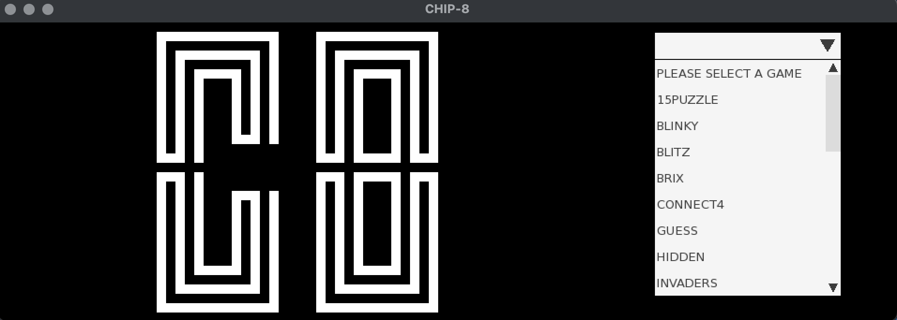
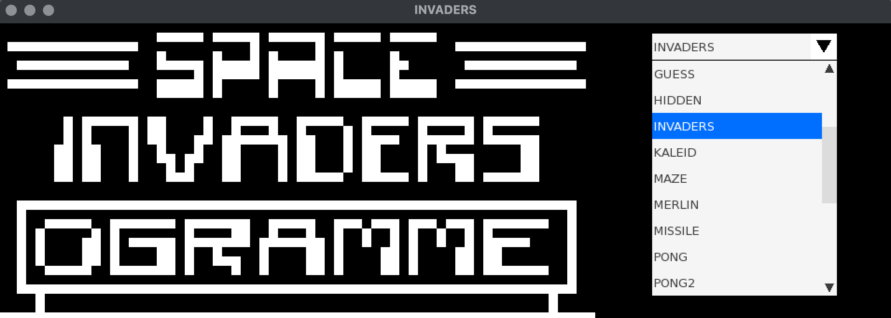
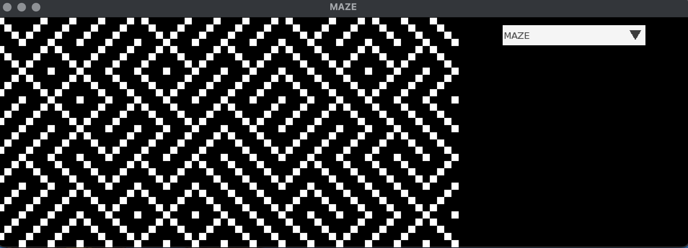

# CHIP-8 Emulator
The "Hello, World" of emulation, if you will, [as aptly described by this Reddit user](https://www.reddit.com/r/cscareerquestions/comments/p4ajd3/is_an_emulator_an_ambitious_project_for_a/).

I initially wanted to create a Game Boy emulator. But as I tried to follow tutorials and decipher the references, I realized that I was very much out of my depth. So I decided to emulate something more basic and accessible, while developing a working knowledge of C++ and assembly along the way, before I embarked on such a tortuous journey completely blindsided. 

Here are some valuable resources that I used as guides and for cross-examining my work: 

* [Cowgod's CHIP-8 Technical Reference](http://devernay.free.fr/hacks/chip8/C8TECH10.HTM)

* [Wikipedia - CHIP-8 Article](https://en.wikipedia.org/wiki/CHIP-8#Opcode_table)

* [Austin Morlan's CHIP-8 Tutorial](https://austinmorlan.com/posts/chip8_emulator/)

* [Tutorials for SFML 2.6 (for rendering and input handling)](https://www.sfml-dev.org/tutorials/2.6/)

And here are the repos from which I obtained the ROMS I tested:

* https://github.com/JamesGriffin/CHIP-8-Emulator
* https://github.com/kripod/chip8-roms/
